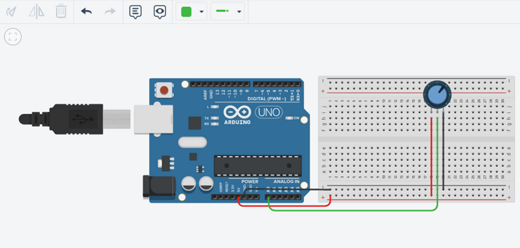
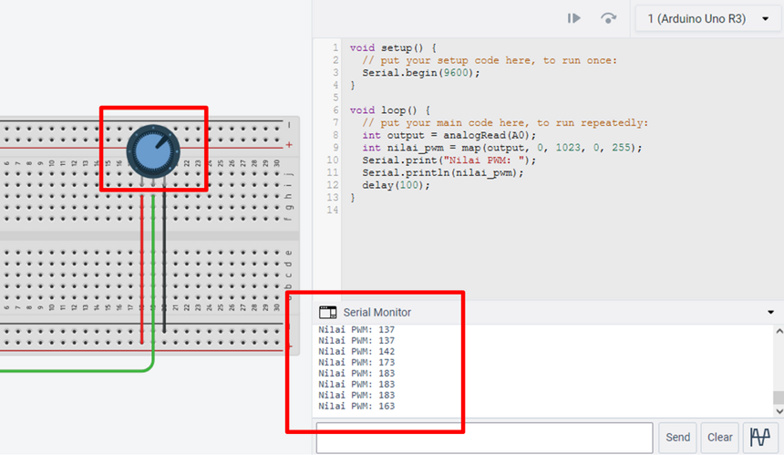
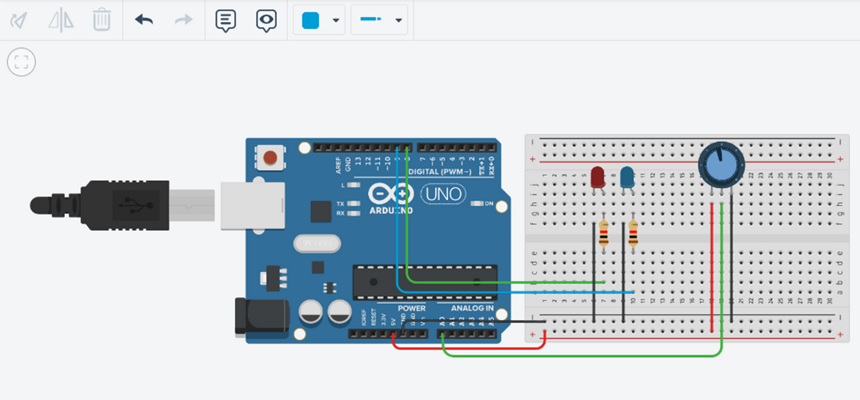

# Pertemuan ke 11 : Praktik Pemrograman Microcontroller

## Topik Bahasan
Proyek Dasar Internet of Things I (Praktik Pemrograman Mikrokontroler, Praktik Sensor: Sensor DHT11, LCD dan Kipas, Praktik Sensor: Ultrasonic, PIR, dan LDR, Praktik Aktuator: LED dan Relay, Praktik Aktuator: Buzzer dan Servo)

## Deskripsi
- Mampu melakukan instalasi, memahami bahasa pemrograman dan pin pada Arduino. 
- Mampu melakukan uji coba serial monitor dan uji coba PWM dengan potensiometer.
- Mampu merancang dan membuat proyek menggunakan sensor DHT22.
- Mampu merancang dan membuat proyek menggunakan sensor Ultrasonic, PIR, dan LDR.
- Mampu merancang dan membuat proyek menggunakan aktuator LED dan Relay.
- Mampu merancang dan membuat proyek menggunakan aktuator Buzzer dan Servo.

## Teori Singkat
Arduino memiliki pin yang dapat bekerja sesuai dengan fungsinya. Pin pada Arduino dikelompokkan menjadi Pin Analog dan Pin Digital.

Pin Analog terdapat pada A0 – A5 yang digunakan untuk menghubungkan dengan sensor analog seperti LDR, potensiometer, sensor kelembaban tanah, dll.

Pin Digital terdapat pada pin 0 – 13 yang digunakan untuk input/output digital. Contoh input digital: Sensor DHT22, Sensor PIR, Sensor ultrasonik, dll.
Contoh output digital: LED, relay, Servo, dll.

**PWM (Pulse Width Modulation)** 
PWM merupakan suatu teknik modulasi yang mengubah lebar pulsa (pulse width) dengan nilai frekuensi dan amplitudo yang tetap. 

PWM dapat dianggap sebagai kebalikan dari ADC (Analog to Digital Converter) yang dapat mengkonversi sinyal Analog ke Digital, PWM ini digunakan untuk menghasilkan sinyal analog dari perangkat Digital (contohnya dari Mikrokontroller). Sehingga keluaran tegangan (ouput) dari mikrokontroler dapat diatur.

### Praktikum Instalasi Arduino IDE
+ Install Arduino IDE, download dari link (https://www.arduino.cc/en/software)
  
+ Buka aplikasi arduino IDE
+ Buka menu File > Preferences.
  
+ Pada kolom "Additional Boards Manager URLs", tulis atau copy-paster alamat berikut
  `https://arduino.esp8266.com/stable/package_esp8266com_index.json`. kemudian klik OK.
  
+ Buka menu Tools > Board > Board Manager. Tuliskan "esp8266" dalam kolom search field. Kalimat "esp8266 by ESP8266
  Community" akan nampak pada daftar di bawahnya, pilih dan klik tombol Install di sebelah kanan bawah.
  

  > Tuliskan pada pencarian `esp8266`
  Klik tombol install, jika gagal turunkan versinya dari 2.6.3 ke 2.6.1. Yang terakhir ketika modul ini dibuat adalah
  > versi 2.7.3, tetapi bukan untuk NodeMCU atau ESP8266 yang digunakan praktikum

  

  Proses installasi ditunjukkan progress bar seperti pada gambar di bawahi ini

  

+ Buka menu dan pilih Tools > Board Manager > NodeMCU 1.0 (ESP-12E Module)
  
  Ketika proses installasi telah selesai dan telah memilih board, seharusnya akan tampil `NodeMCU 1.0 (ESP-12E Module)`
  

+ Sekarang masukkan kabel data USB dari NodeMCU ke Laptop, kemudian cek terlebih dahulu di Control Panel > Device
  Manager. Gambar di bawah menunjukkan bahwa interface antara NodeMCU dan Laptop Windows 10 telah terhubung melalui
  PORT COM3 (alamat COM setiap orang tidak selalu sama, tergantung dari komputer masing-masing).
  
  > Ketika port belum terdeteksi, maka harus install terlebih dahulu drivernya yang dapat diunduh di
  [https://www.silabs.com/products/development-tools/software/usb-to-uart-bridge-vcp-drivers](https://www.silabs.com/products/development-tools/software/usb-to-uart-bridge-vcp-drivers)
  >
  > Ketika menggunakan sistem operasi Mac OS akan terdeteksi di `/dev/tty.SLAB_USBtoUART`, bukan *
  */dev/tty.Bluetooth-Incoming-Port**
+ Buka aplikasi Arduino IDE, pilih menu Tools > Board, yang semula defaultnya mungkin “Board: Arduino / Genuino Uno”
  menjadi “NodeMCU 1.0 (ESP-12E Module)”
  

  > Board NodeMCU adalah board yang saat ini, NodeMCU 1.0 (ESP-12E Module) aktif

  

+ Buka aplikasi Arduino IDE pada menu Tools > Port > COM3 (sesuaikan dengan nomor port masing-masing) .
  

+ Jalankan aplikasi standard seperti di bawah ini, kemudian klik tombol centang di bagian toolbar atas.
  

Jika tidak ada pesan error, berarti instalasi sukses dan siap digunakan

### Praktikum 1: Membuat Akun Tinkercad
Selesaikan langkah-langkah praktikum berikut ini menggunakan Tinkercad di browser Anda.

1. **Masuk ke https://www.tinkercad.com/ dan buat akun baru dengan klik Join Now**

2. Pilih Create a personal account untuk membuat akun baru.
 
3. Pembuatan akun bisa dengan akun Google, Apple, atau membuat akun khusus Tinkercad.

4. Buka email dan konfirmasi pembuatan akun Tinkercad.

### Praktikum 2: Membuat Circuits
Selesaikan langkah-langkah praktikum berikut ini menggunakan Tinkercad di browser Anda.

1. Login dengan akun yang sudah dibuat.

2. Klik Design, Circuit

3. Klik Create New Circuit untuk membuat rangkaian baru

 

- Dari panel sebelah kanan Tambahkan
	- Arduino Uno R3 dengan klik Arduino Uno R3 pada bagian Components.
 	- Tambahkan juga Breadboard Small, Potensiometer, Resistor, dan LED.
 

4. **Hubungkan semua komponen seperti pada gambar**.

 
5. Buat kode program dengan klik Code. Hapus program bawaan dengan klik & drag blocks yang sudah ada ke trash.

6. Untuk membuat program LED berkedip Pilih set pin 0 to HIGH dan masukkan ke blocks space.
Klik Control, pilih wait 1 secs dan gabungkan dengan program sebelumnya.

7. Ulangi langkah sebelumnya hingga menjadi blocks seperti di bawah ini.
Ubah pin yang akan digunakan, yaitu pada set pin, ubah menjadi 8. Pada bagian bawah, atur menjadi set pin 8 to LOW. Program tersebut artinya pin 8 akan berada dalam kondisi menyala (HIGH) selama 1 detik, kemudian pin 8 akan mati (LOW) selama 1 detik.

 
8. Klik Start Simulation untuk menyalakan memulai simulasi. LED akan menyala selama 1 detik, kemudian mati selama 1 detik. Klik Stop Simulation untuk menghentikan simulasi.

 
 
9. Tambahkan LED dan resistor menjadi 3 buah. Ganti warna LED. Hubungkan rangkaian seperti pada gambar dan ganti warna kabel sesuai dengan warna LED.

 
10. Klik Code untuk membuat kode program. Tambahkan blocks program seperti pada gambar disamping. Program tersebut untuk menyalakan LED satu per satu, kemudian nyala bersama dan mati bergantian.

 
11. Tinkercad memungkinkan untuk menampilkan/membuat kode program Arduino berdasarkan blocks yang sudah dibuat.
Klik Code, klik pada bagian Blocks, pilih Block + Text
Akan muncul kode program yang dihasilkan (generate) dari blocks yang sudah dibuat.
Kode program ini merupakan kode yang dapat digunakan dalam pemrograman Arduino yang sebenarnya.

### Praktikum 3: Praktikum sederhana dengan Wokwi
Selesaikan langkah-langkah praktikum berikut ini menggunakan Wokwi di browser Anda.

1. **Masuk ke https://www.wokwi.com/, registrasi dan login, kemudian pilih ESP32**
   

2. Pilih starter templates board ESP32
   

3. Buat Rancangan board ESP32 seperti contoh

4. Duplikasi Code berikut

5. Jalankan program dengan klik tombol play simulation

## Tugas Mandiri 
Selesaikan langkah-langkah praktikum berikut ini menggunakan Tinkercad di browser Anda.

1. **Tugas 1**
- Buatlah blocks program agar LED menyala satu per satu, dan mati satu per satu.
Contoh: LED merah menyala, kemudian LED kuning menyala bersamaan dengan LED merah mati, LED hijau menyala bersamaan dengan LED kuning mati, dan seterusnya.
 

2. **Tugas 2**
- Buatlah sebuah rangkaian perangkat IoT menggunakan salah satu tool yang telah dipelajari sebelumnya, rangkaian IoT tersebut bisa Anda temukan di artikel atau tulisan ilmiah. Jangan lupa menyertakan URL atau alamat artikel tersebut
